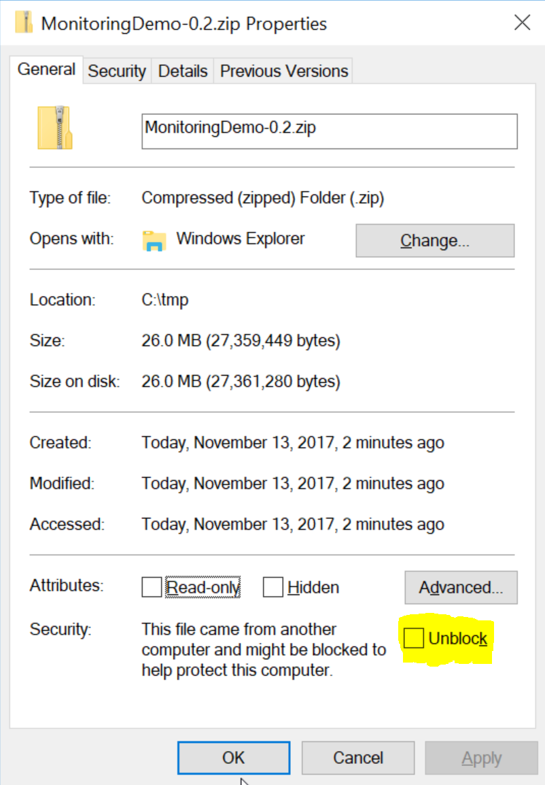

This document explains how to set up the [NServiceBus monitoring demo](/tutorials/monitoring-demo/) in detail.

## Prerequisites

In order to run the demo your system needs to meet the following requirements:

- Windows 8 or higher
- .NET Framework 4.6.1 and higher

## Running the sample

The sample zip file includes 4 endpoints and the Particular Software Platform components, all of which have been configured to talk to each other using the Learning Transport.

Once you have downloaded the zip package make sure to **unblock** it in the file properties, if needed:

After unblocking the zip file, extract its contents into a folder. For the rest of this tutorial, we will refer to this folder as `MonitoringDemo`.

Open the `MonitoringDemo` folder and double-click on `run.bat`. This script will:

1. You will be prompted to run the remaining steps with elevated privileges. This is needed so that processes can bind to their network ports.
2. Run ServiceControl components, each in their own window.
    - A ServiceControl instance (binds to port 33533)
    - A Monitoring instance (binds to port 33833)
3. Run the sample endpoints, each in their own window
4. Run ServicePulse, in it's own window (binds to port 8051)
5. Open your default browser to the ServicePulse monitoring tab.
6. Wait for ENTER key, and will quit all processes and optionally removes the created SQL LocalDB instance.

## Explore the demo

Once you have the demo up and running, [begin exploring the demo](/tutorials/monitoring-demo/#demo-walk-through).
